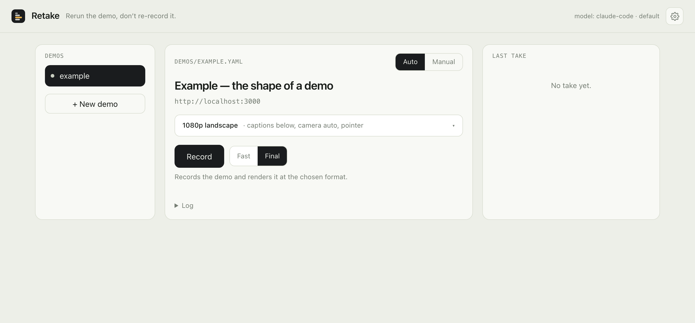

<p align="center"></p>

<p align="center">
  <b>Rerun the demo. Don't re-record it.</b><br>
  A product walkthrough as a small YAML file. Your coding agent writes it, Retake records it, you watch and ship it.
</p>

<p align="center">
  <a href="https://www.npmjs.com/package/retake-demos"></a>
  <a href="LICENSE"></a>
  <a href="https://github.com/glebbogachev00/retake/actions/workflows/ci.yml"></a>
</p>

---

Retake drives a real browser through a web app, records it, and hands back an MP4 with burned-in captions, a still for every scene, and a proof log of exactly what happened. The demo is a file, so when a button moves you change a selector instead of re-shooting — and when the app changes, you rerun the same file.

It is built for the way people work now: **you ask your coding agent for a demo in one sentence**, the agent drafts the file, dry-runs every selector, records a preview, reads the proof log, fixes what failed, and records the real one. Claude Code, Codex, Cursor and anything else that speaks MCP get Retake's tools; `retake ui` is the window you watch it in.

<p align="center"></p>

## Install

Needs Node 20+. ffmpeg ships with the package; Chromium is downloaded once.

```bash
npm install -g retake-demos
mkdir my-demos && cd my-demos
retake install
```

`retake install` makes the folder a workspace (`demos/`, `outputs/`, `.env`, the `.gitignore` lines), downloads Chromium, registers the tools with Claude Code and installs its *recording-product-demos* skill, and prints the config for Codex. Restart your agent afterwards — agents load tools at the start of a session.

Prefer not to install globally? `npx retake-demos install` works the same. Don't use Claude Code? `retake agent` prints the MCP config for Codex, Cursor, or anything else.

Then, in your agent:

> Record a demo of my app at localhost:3000 showing a new user creating their first project.

and in another terminal, `retake ui` → http://localhost:4310 to watch it happen. The agent reports its plan and progress there; the video, stills and receipts land there when it's done.

`retake doctor` tells you if anything is missing.

## What you get

```
outputs/<name>/
  demo.mp4        the shareable — captions burned in
  master.mp4      the CRF-14 keeper (post presets only)
  stills/         one PNG per scene, mid-scene and at its last moment
  thumbnail.png   the frame at a chosen scene
  proof-log.md    result, shot list, every step's timing, pass/fail, what was on screen when it failed
  take.json       the raw timeline the renderer reads
```

In the window: play it, switch speed (0.75× to 2×, re-rendered in seconds), download, show in Finder, open the file to edit. Demos group by the app they point at; archive what you're done with.

## The loop

Everything an agent does, you can do from the terminal:

```bash
retake validate demos/x.yaml   # schema + warnings, instant
retake dry demos/x.yaml        # every selector and wait, no camera (~30s)
retake run demos/x.yaml --preset draft   # first take, quarter-size, fast
retake check outputs/x         # resolution, fps, duration, files: pass/fail
retake run demos/x.yaml        # the real one
retake render outputs/x        # captions/camera/speed changed? re-render, no browser
```

The expensive step comes last on purpose. `dry` catches most failures in seconds and prints the step, the error, and the text that was on screen; a failed `run` costs a minute and a confusing video. When a step fails during `run`, Retake stops, keeps what it has, and the proof log says which step and why — an agent fixes it from that text, never from watching the video.

Exit codes: `0` good · `2` a step failed or the video is a raw fallback · `3` `dry`/`check` failed.

## Demo-as-code

```yaml
name: first-project
title: "Creating your first project"
url: http://localhost:3000
preset: post-landscape            # `retake presets` — 1920×1080 page + caption band
viewport: { width: 1440, height: 1080 }
scale: 1.8                        # page drawn at 1.8× so text stays crisp
reducedMotion: true
camera: auto                      # each scene eases toward the last thing touched

seed: []                          # put the app in a known state first
setup: []                         # runs before the camera; trimmed off the video

steps:
  - { action: scene, label: start, caption: "An empty workspace.", camera: static }
  - { action: wait, ms: 1500 }
  - { action: click, selector: "button:has-text('New project')", pauseAfter: 800 }
  - { action: type, selector: "input[name=title]", text: "Q3 launch plan", delay: 40 }
  - { action: click, selector: "button[type=submit]" }
  - { action: waitFor, selector: ".project-header" }
  - { action: scene, label: result, caption: "And it exists." }
  - { action: wait, ms: 2500 }

outputs:
  thumbnail: { scene: result }
```

The full template is [`demos/example.yaml`](demos/example.yaml); `retake init` copies it into a new workspace.

**Steps** — `click`, `type`, `fill`, `hover`, `drag`, `scroll`, `keyboard`, `navigate`, `wait`, `waitFor`, `evaluate`, `upload`, `download`, `screenshot`, `scene`. Every step takes `pauseAfter`, `waitFor`, `timeout`, `secret`. Targets are a selector, or a point — `{x, y}` or `{selector, dx, dy}` — for canvases and SVG editors. `${VAR}` expands from `.env` and fails loudly when unset.

**Scenes** are the spine: `{ action: scene, label, caption }` at each beat. They take their timestamps from the actual run, so captions land on the frames they describe even when the app took 3 seconds this time and 11 the last.

**Seeds** put the app in a known state before the camera: write a JSON file, run JS in the page, or run a shell command. **Setup** is the stuff that runs before recording and is trimmed off the front — logins live there. **`tempo`** speeds the finished video up or down at render time; **`lock`** names a shared resource so two demos that touch the same backend don't record over each other.

## Quality

Think in the publishing format, not the browser window.

| Preset | Video | Page area | For |
|---|---:|---:|---|
| `draft` | 960×616 | 960×540 | iterating — the finals' layout at a quarter of the pixels, fastest |
| `preview-fast` | 1920×1230 | 1920×1080 | checking timing and framing, hardware-encoded |
| `post-landscape` *(default)* | 1920×1230 | 1920×1080 | the general-purpose demo, plus a CRF-14 master |
| `post-square` | 1080×1080 | 1080×950 | feeds — a true square |
| `post-vertical` | 1080×1920 | 1080×1750 | shorts and reels — a true 9:16 |
| `docs-gif` | 1440×1000 | 1440×900 | README and docs GIFs |
| `master` | 1920×1230 | 1920×1080 | archive, CRF 12 |

**The video is the page area plus the caption band.** Landscape keeps a full 1920×1080 page and the band goes under it (1920×1230) — the captions never cover the app. Square and vertical fit the band inside the canvas, because a feed that wants 1:1 or 9:16 will letterbox anything else. A manifest's `viewport` replaces the page area and the video follows it, so a 1240×1080 viewport gives a 1240×1230 video. `retake presets` prints this table, and `retake validate` tells you the exact size of the video a manifest will produce before you record it.

**Page scale** is what makes it crisp: the page lays out as if the viewport were smaller and every glyph is drawn at 2×, so 1080p text reads on a phone. **Camera** eases toward whatever the demo just touched, at render time, clamped so it can never crop the thing it points at — per scene: `camera: static` or `camera: { focus: ".result", zoom: 1.3 }`. Captions, camera, speed, trim, format and layout are all render-time: change them and `retake render` takes seconds, never touches the browser.

## Signing in

```yaml
auth:
  storageState: .auth/myapp.json   # session saved here, reused until stale
  maxAgeHours: 8
setup:
  - { action: fill, selector: "#user", text: "${APP_USER}" }
  - { action: fill, selector: "#password", text: "${APP_PASSWORD}", secret: true }
  - { action: click, selector: "button[type=submit]" }
```

Secrets live in `.env`, never in a manifest. `secret: true` keeps a value out of the terminal, the window and the proof log — but not out of the video, which is why `validate` warns when a secret step is in `steps` rather than `setup`. A session is only saved when the sign-in actually succeeded. Use a demo account: the output is a video you may publish.

Apps that keep their session in IndexedDB (Firebase) can't be restored from `storageState`; put the login in plain `setup` instead.

## Limits worth knowing

- **One page.** Retake records one tab. `keepInTab` (on by default) folds `window.open` and `target="_blank"` back into it, so popup logins and "preview" buttons stay on camera; flows that genuinely need a second window do not.
- **~45 cursor moves per take.** The cursor overlay is one nested expression per move and ffmpeg's parser has a depth limit. `validate` warns, the recorder detects it, `check` fails. Split long stories into chapters of 30–45 seconds — the viewer agrees.
- **`scale` uses CSS zoom**, which shifts the coordinate space some forms rely on for focus; if typing goes nowhere, `scale: 1`. (`deviceScaleFactor` is not the fix — Playwright's screencast never upscales.)
- **macOS is where it's used daily.** `videotoolbox` hardware encoding falls back to libx264 elsewhere; Linux is untested beyond CI.

## How it's built

```
src/
  cli.ts          install · init · doctor · ui · run · dry · render · check · validate · describe · ideas
  manifest.ts     zod schema, presets, warnings
  record.ts       Playwright + testreel → take.json (seeds, auth, locks, stop-on-fail, drag)
  dryrun.ts       every selector and wait, no camera
  render.ts       ffmpeg: camera → layout → captions → demo/master, stills, check
  edits.ts        structural edits agents make to a manifest (comments preserved)
  operator/       the MCP server: 22 tools, from `scout` and `draft` to `run`, `look` and `done`
  ui/             one http server, three pages, no framework, no build step
skill/SKILL.md    what the agent is taught: order of operations, failures as text, when to stop
demos/            manifests; outputs/ is where takes land
```

Recording and the cursor come from [testreel](https://github.com/greentfrapp/testreel); GIFs from [gifski](https://github.com/ImageOptim/gifski) when installed; ffmpeg from `ffmpeg-static`. Retake adds what the job needs on top: waiting on selectors, seeds, scenes with real timestamps, camera and captions at render time, presets, credentials, locks, structural edits, and the receipts.

## Developing

```bash
git clone https://github.com/glebbogachev00/retake && cd retake
npm install                      # also builds dist/
npx playwright install chromium
npm run retake -- run demos/todo-basics.yaml --preset draft   # a public app, no setup
npm test && npm run typecheck
```

`npm run retake -- …` runs the TypeScript source; `retake …` is the built package — same code. See [CONTRIBUTING.md](CONTRIBUTING.md), [BACKLOG.md](BACKLOG.md), and [AGENTS.md](AGENTS.md) (what coding agents read when pointed at this folder). Found something off? The **Bug?** button in the window pre-fills an issue with the receipts.

## License

[MIT](LICENSE) — Gleb Bogachev.
